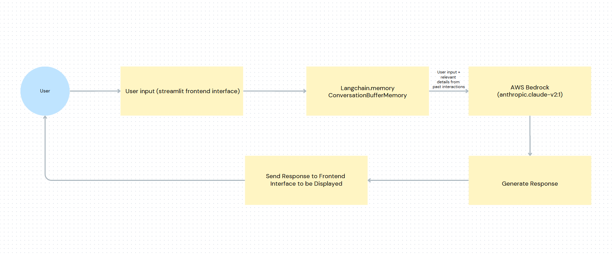

# AWS Bedrock Character-Based Chatbot

Developed a personalized chatbot using AWS Bedrock that will respond to user questions with a specific emotional tone depending on the selected character. The frontend interface is fully developed using Streamlit and the AI chatbot has integrated memory from langchain to futher improve conversation flow and realism. 

# Features

### Character based responses

The user will recieve personalized responses with a specific emotional tone depending on the selected character profile. 

### Chatbot Memory

The chatbot has a memory buffer to store previous user interactions to improve user experience by incorporating previous interactions into current responses allowing for a better flow of conversation.

# Future add-ons

Improve the LLM's ability to respond to diverse inputs by training the model on more diverse data sets to allow the model to be exposed to a larger range of inputs. 

# View the app

To view the application, ensure all the dependencies are installed. Once that is complete, clone the repository to your local machine, and run the following command: streamlit run frontend.py, as this will open a new tab in your browser allowing you to interact with the application. 

# Visual Representation of the Logical Flow of the App

